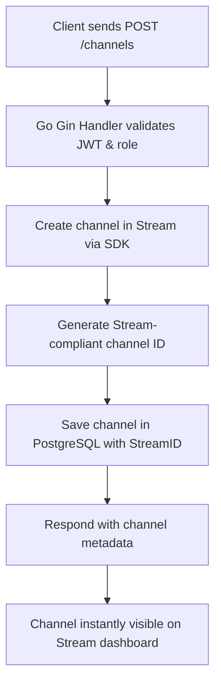
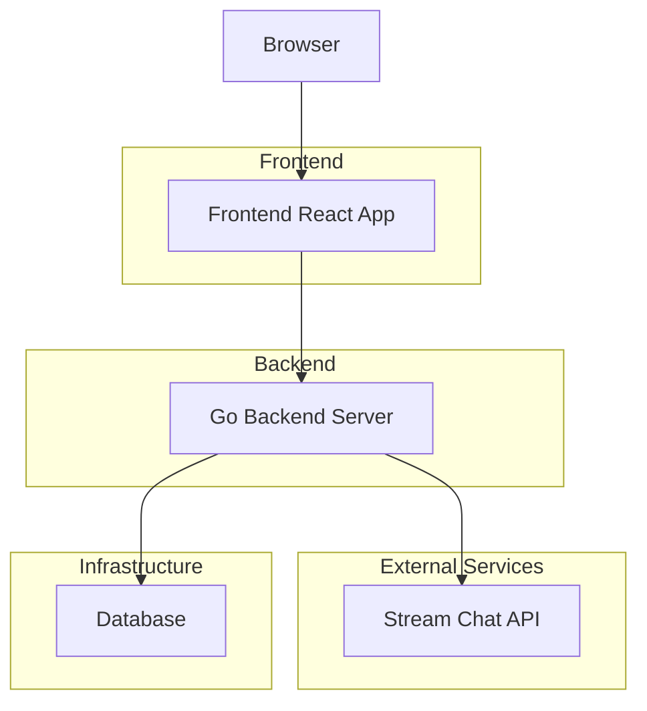

# 🚀 Building Real-Time Chat Channels with Go and Stream

## Introduction
Go’s robust backend capabilities make it an excellent choice for integrating with [Stream](https://getstream.io/)—a leading provider of scalable, real-time chat APIs. This guide demonstrates how to create chat channels in a multi-tenant Go application, syncing them between your backend, database, and the Stream platform.

---

## 1. Project Overview

- **Tech Stack:** Go (Gin, GORM), PostgreSQL, Stream Chat SDK
- **Architecture:** Multi-tenant chat app with JWT authentication and role-based access control.
- **Goal:** When an admin/moderator creates a channel, it’s created both in the local database and in Stream, with all metadata synced.

---

## 2. Channel Creation Flow

### a. API Endpoint

- **Endpoint:** `POST /channels`
- **Auth:** Requires a valid JWT (admin/moderator role)
- **Payload Example:**
  ```json
  {
    "name": "Ekemini Samuel",
    "description": "EkeminiOS channel for the team"
  }
  ```

### b. What Happens Under the Hood






#### **Handler Code Snippet**
```go
func CreateChannel(c *gin.Context) {
    var req struct {
        Name        string `json:"name" binding:"required"`
        Description string `json:"description"`
    }
    if err := c.ShouldBindJSON(&req); err != nil {
        c.JSON(http.StatusBadRequest, gin.H{"error": "Invalid request"})
        return
    }
    userRole, _ := c.Get("user_role")
    if userRole != string(models.RoleAdmin) && userRole != string(models.RoleModerator) {
        c.JSON(http.StatusForbidden, gin.H{"error": "Insufficient permissions"})
        return
    }
    tenantID, _ := c.Get("tenant_id")
    userID, _ := c.Get("user_id")
    streamChannelID, err := services.CreateStreamChannel(models.Channel{
        Name:        req.Name,
        Description: req.Description,
        TenantID:    tenantID.(string),
        CreatedBy:   userID.(string),
    }, userID.(string))
    if err != nil {
        c.JSON(http.StatusInternalServerError, gin.H{"error": "Could not create Stream channel"})
        return
    }
    channel := models.Channel{
        StreamID:    streamChannelID,
        Name:        req.Name,
        Description: req.Description,
        TenantID:    tenantID.(string),
        CreatedBy:   userID.(string),
    }
    if err := db.DB.Create(&channel).Error; err != nil {
        c.JSON(http.StatusInternalServerError, gin.H{"error": "Could not create channel in DB"})
        return
    }
    c.JSON(http.StatusCreated, channel)
}
```

#### **services.CreateStreamChannel Example**
```go
func CreateStreamChannel(channel models.Channel, creatorID string) (string, error) {
    client := GetStreamClient()
    shortTenantID := channel.TenantID
    if len(shortTenantID) > 8 {
        shortTenantID = shortTenantID[:8]
    }
    channelID := shortTenantID + "-" + uuid.New().String()
    ch, err := client.CreateChannel(
        context.Background(),
        "messaging",
        channelID,
        creatorID,
        &stream.ChannelRequest{
            Members: []string{creatorID},
            ExtraData: map[string]interface{}{
                "tenant_id": channel.TenantID,
                "name": channel.Name,
                "description": channel.Description,
            },
        },
    )
    if err != nil {
        log.Printf("Stream CreateChannel error: %v", err)
        return "", err
    }
    return ch.Channel.ID, nil
}
```

---

## Messaging Flow: Backend Integration with Stream

### Environment Variables
```
STREAM_API_KEY=your_stream_api_key
STREAM_API_SECRET=your_stream_api_secret
DATABASE_URL=your_postgres_url
JWT_SECRET=your_jwt_secret
```

### Key Go Features Used
- Gin HTTP framework for routing and middleware
- GORM for ORM/database
- JWT middleware for authentication
- Context for API calls
- Environment variables for configuration

### Main Handlers
- **POST /messages**: Send a message to a Stream channel
- **GET /messages/{stream_id}**: Retrieve recent messages from a Stream channel

### How Messaging Works
- **Send Message:**
  - Endpoint: `POST /messages`
  - Payload:
    ```json
    {
      "stream_id": "<stream_channel_id>",
      "text": "Hello world!"
    }
    ```
  - Requires JWT authentication.
  - The backend uses the Stream Go SDK to send the message to the specified channel.

- **Get Messages:**
  - Endpoint: `GET /messages/{stream_id}`
  - Returns the most recent messages from the Stream channel.
  - Requires JWT authentication.

### How to Get `stream_id`
- When creating/listing channels, the `stream_id` is returned in the response.
- Use `/channels` endpoint to list all channels for the tenant and obtain the `stream_id`.

### Example Requests
- **Send Message:**
  ```bash
  curl -X POST http://localhost:8080/messages \
    -H "Authorization: Bearer <JWT_TOKEN>" \
    -H "Content-Type: application/json" \
    -d '{"stream_id": "17006115-1c2a6a40-59d8-4e36-8527-a8b4d65d9d91", "text": "Hello EkeminiOS!"}'
  ```
- **Get Messages:**
  ```bash
  curl -X GET http://localhost:8080/messages/17006115-1c2a6a40-59d8-4e36-8527-a8b4d65d9d91 \
    -H "Authorization: Bearer <JWT_TOKEN>"
  ```

### Connecting to Stream
- The backend uses `services.GetStreamClient()` to initialize the Stream Go SDK with your API keys.
- All message operations are performed directly against Stream, not the local database.

### Security
- JWT authentication is required for all messaging endpoints.
- Role-based access control is enforced where needed.

### Swagger Documentation
- All endpoints are documented with JWT authentication in Swagger UI.
- You can authorize with a JWT token in the Swagger UI to test endpoints.

---

## Frontend API Integration Guide

### 1. Sign Up
- Endpoint: `POST /auth/register`
- Returns: JWT token, user info

### 2. Login
- Endpoint: `POST /auth/login`
- Returns: JWT token, user info

### 3. Tenants
- Endpoint: `GET /tenants` (list), `POST /tenants` (create)
- Use JWT in Authorization header

### 4. Channels
- Endpoint: `GET /channels` (list), `POST /channels` (create)
- Use JWT in Authorization header
- `stream_id` is returned for each channel

### 5. Chat Messaging
- **Send Message:**
  - Endpoint: `POST /messages`
  - Payload: `{ "stream_id": "...", "text": "..." }`
  - Use JWT in Authorization header
- **Get Messages:**
  - Endpoint: `GET /messages/{stream_id}`
  - Use JWT in Authorization header

### 6. Stream JS SDK (Frontend Realtime)
- Get a Stream token for the current user:
  - Endpoint: `GET /stream/token`
  - Use JWT in Authorization header
- Use the token to authenticate Stream JS SDK in the frontend for real-time messaging.

### 7. Example: Fetch Messages in React
```js
fetch(`/messages/${streamId}`, {
  headers: { Authorization: `Bearer ${jwt}` }
})
  .then(res => res.json())
  .then(data => setMessages(data.messages));
```

### 8. Example: Send Message in React
```js
fetch('/messages', {
  method: 'POST',
  headers: {
    'Authorization': `Bearer ${jwt}`,
    'Content-Type': 'application/json'
  },
  body: JSON.stringify({ stream_id: streamId, text: message })
})
  .then(res => res.json())
  .then(data => {/* handle response */});
```

---

## Troubleshooting
- Ensure all environment variables are set in `.env`.
- JWT token must be present in all protected requests.
- If messages are not appearing, check Stream dashboard and backend logs.

---

## 3. Why Go + Stream is a Winning Combo

- **Type Safety:** Go’s static types and strict model hooks ensure data integrity from DB to API.
- **Performance:** Go’s concurrency and Gin’s lightweight HTTP handling mean fast, scalable endpoints.
- **Developer Experience:** GORM auto-migration (with explicit model hooks) makes schema evolution easy, while Stream’s Go SDK is idiomatic and well-documented.
- **Real-Time Power:** Channels are live on Stream instantly—no polling, no lag.

---

## 4. Troubleshooting & Lessons Learned

- **UUIDs vs. Stream IDs:**
  Store your Stream channel ID in a separate field (`stream_id`), not as the DB primary key.
- **Schema Evolution:**
  Use GORM’s auto-migrate for new fields, but be ready to run manual SQL for production DBs.
- **Error Handling:**
  Always log and surface errors from Stream for easy debugging.

---

## 5. Conclusion

Go makes it easy to build robust, real-time chat backends that play perfectly with Stream. With just a few lines of code, you get secure, scalable, and fully synchronized chat channels—ready for production.

> **Go’s strong typing and Stream’s real-time APIs are a perfect match for modern chat apps—fast to build, easy to maintain, and ready to scale.**

---

## 6. References
- [Stream Chat Go SDK](https://getstream.io/chat/docs/go/)
- [Gin Web Framework](https://gin-gonic.com/)
- [GORM ORM](https://gorm.io/)

---

*Generated with love by Go and Stream!*
